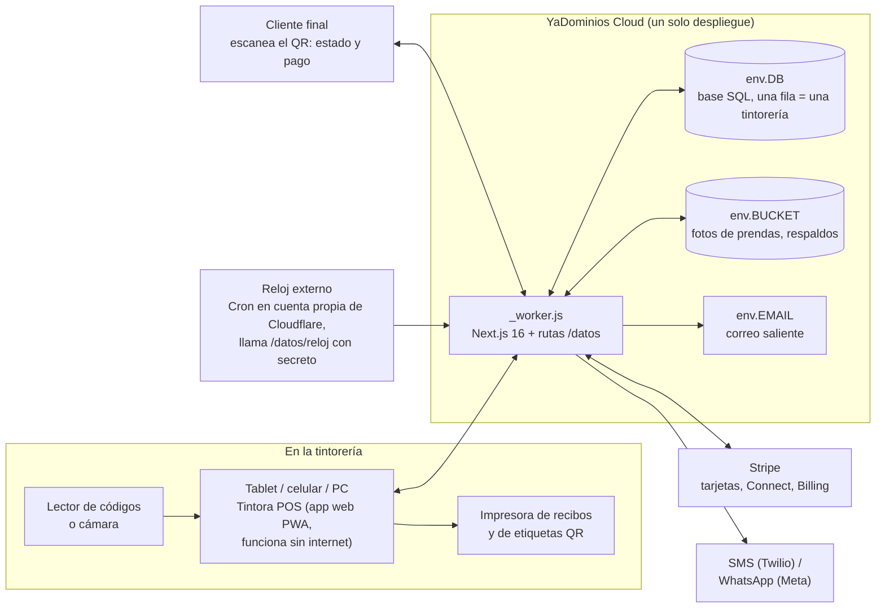

# Tintora POS — Estudio y propuesta del proyecto

**Fecha:** 16 de septiembre de 2026
**Estado:** propuesta. No hay una sola línea de código todavía.
**Dueño:** Richard (Windoce LLC)

> Este documento es el punto de partida del proyecto. Se escribe para que
> cualquier persona, o cualquier IA en otra sesión sin memoria, entienda qué
> se va a construir, para quién, cómo se cobra, cómo está hecho por dentro y
> por qué es seguro. Cuando algo de aquí cambie, se cambia aquí.

---

## 1. En una frase

**Tintora POS es el punto de venta y la gestión completa de una tintorería o
lavandería, en la nube, que corre en cualquier tablet o celular, funciona
aunque se caiga el internet, y le avisa al cliente por WhatsApp o SMS cuando
su ropa está lista.** Bilingüe español/inglés desde el día uno, pensado para
el mercado de Estados Unidos y Latinoamérica.

---

## 2. A quién se le vende y qué le duele

**El cliente que paga:** el dueño de una tintorería (dry cleaner), lavandería
por libras (wash & fold), lavandería con planchado, o una pequeña cadena de
dos a diez locales. Muchísimos de estos negocios en EE.UU. son de familias
latinas o inmigrantes, y hoy los administran con talonarios de papel, una hoja
de Excel o un sistema viejo instalado en una computadora que nadie sabe
actualizar.

**Lo que le duele hoy (y lo que Tintora POS le resuelve):**

| Dolor de todos los días | Qué hace Tintora POS |
| --- | --- |
| Tickets de papel que se pierden o se mojan; prendas que nadie sabe de quién son | Cada prenda lleva etiqueta con código QR; se escanea y aparece el dueño, el servicio y dónde está colgada |
| «¿Ya está lista mi ropa?» — llamadas todo el día | Aviso automático por WhatsApp/SMS/correo cuando la orden pasa a «lista», con enlace para ver el estado |
| Ropa que nadie recoge y ocupa espacio meses | Recordatorios automáticos y política de abandono configurable por tienda, con registro de los avisos enviados |
| No sabe cuánto vendió, ni quién hizo descuentos, ni si cuadra la caja | Cierre de caja por turno, reportes por día/empleado/sucursal, y todo descuento o anulación queda con nombre y hora |
| El empleado cobra y no registra | PIN por empleado, anulaciones solo con permiso de gerente, auditoría que no se puede borrar |
| Se fue el internet y no se puede cobrar | La aplicación sigue funcionando sin conexión y sincroniza sola cuando vuelve |
| Tiene dos locales y una planta central | Multi-sucursal: la ropa se recibe en la tienda, viaja a la planta y vuelve, y el sistema sabe en qué punto está |
| Los sistemas viejos cobran instalación, hardware propio y contratos largos | Corre en el navegador de cualquier tablet o celular; sin instalación, sin contrato largo |

---

## 3. Competencia (nombres a verificar, sin precios de memoria)

Existen sistemas para este nicho. Los que conocemos por nombre y hay que
estudiar con fuentes frescas antes de fijar precio y mensaje comercial:

- CleanCloud
- SMRT Systems
- Enlite POS
- SPOT (Xplor)
- Cents
- Compassmax
- Geelus
- Turns
- Cleantie

**Regla de la casa:** precios, límites y funciones de la competencia **no se
dicen de memoria**. Esa investigación se hace en la sesión de Laboratorio AI y
queda como documento (`investigaciones/AAAA-MM-DD-tintora-pos-competencia.md`).
Está anotada en `PENDIENTES.md`.

Lo que sí sabemos sin investigar: casi todos son solo en inglés o con español
de traducción automática, casi ninguno avisa por WhatsApp, y varios dependen
de hardware propio o de una computadora instalada en el local.

### 3.1 Código libre existente: qué encontramos y por qué se parte de cero

Búsqueda hecha el 16 de septiembre de 2026 en GitHub (términos: laundry pos,
laundry management, dry cleaning, laundromat, lavandería, tintorería, laundry
saas, y los temas `laundry` y `dry-cleaning`), mirando estrellas, licencia,
tecnología y última actividad.

| Repositorio | Estrellas | Tecnología | Licencia | Veredicto |
| --- | --- | --- | --- | --- |
| andes2912/laundry | 165 | PHP / Laravel | MIT | Servidor PHP; no corre en YaDominios Cloud. Una sola tienda |
| mohaiminur/laundry | 71 | PHP a mano | **ninguna** | Sin licencia no se puede usar; abandonado desde 2020 |
| HashJProgramming/LMS-Laundry-Management-System-with-QRCode | 24 | PHP a mano | MIT | Una sola tienda; PHP; sirve solo como referencia de pantallas (QR por prenda) |
| fahrudina/smart-laundry-pos | 14 | React + Vite + Supabase + Capacitor | **ninguna** | El único moderno (PWA, sin conexión, WhatsApp), pero sin licencia y atado a Supabase/Postgres. Referencia de funciones, no de código |
| avikganguly01/laundry-management-system | 14 | Java | MIT | Abandonado desde 2014 |
| Nabanyi/Laundry-POS | 1 | PHP / CodeIgniter | MIT | Una tienda real; PHP |
| Resto (Java, Dart, Django, Laravel, proyectos de tesis) | < 15 | varias | casi todos sin licencia | Ejercicios académicos o de una sola tienda |

**Veredicto: no hay base que valga la pena. Se parte de cero.** Razones:

1. **Ninguno corre donde publicamos.** Todos son PHP, Java o dependen de
   Supabase/Postgres. YaDominios Cloud corre JavaScript en el borde con su
   base SQLite (`env.DB`). Portar cualquiera de ellos cuesta más que
   escribirlo bien.
2. **Ninguno es multi-inquilino.** Son sistemas de una sola tienda; el
   aislamiento entre tintorerías (el punto 8.1, el más importante para vender
   a terceros) habría que meterlo a la fuerza en un diseño que no lo previó.
3. **Los dos más útiles no tienen licencia.** Sin licencia, el código es del
   autor y no se puede reutilizar en un producto comercial.
4. **Ninguno es bilingüe ni está pensado para EE.UU.** (impuestos por estado,
   SMS con registro A2P, prendas abandonadas).

Lo que sí sirve de ellos: **la referencia de qué esperan los usuarios** (el
estándar del oficio en Sudamérica y en EE.UU.), que ya está recogido en el
punto 5: orden por cliente con prendas individuales, etiqueta con QR por
prenda, estados recibida → en proceso → lista → entregada, pago total o abono,
fecha promesa con marca de atraso, avisos al cliente, cierre de caja y
reportes por día y por empleado. Tintora POS nace con ese estándar y le suma
lo que ninguno tiene: multi-tienda, bilingüe, sin conexión, WhatsApp y
seguridad de producto vendible.

---

## 4. Con qué gana Tintora POS

1. **Bilingüe de verdad.** Español e inglés perfectos, con selector arriba.
   El dueño trabaja en español y su cliente recibe el aviso en el idioma que
   eligió. Nadie más en este nicho lo hace bien.
2. **WhatsApp.** El cliente latino vive en WhatsApp. Un aviso de «tu ropa está
   lista» por WhatsApp se lee; un SMS a veces no.
3. **Funciona sin internet.** Un punto de venta que se queda mudo cuando cae la
   conexión es un punto de venta que se abandona. Tintora POS cobra igual y
   sincroniza después.
4. **Sin hardware propio, sin instalación.** Cualquier tablet, celular o
   computadora con navegador. Impresoras de recibos y etiquetas normales.
5. **Etiqueta con QR en cada prenda** y portal público para el cliente: escanea
   el ticket y ve el estado, y puede pagar desde el celular antes de pasar.
6. **Transparencia con el dueño:** todo queda registrado con nombre y hora, y
   él puede exportar todos sus datos cuando quiera. Sus datos son suyos.
7. **Docs estilo Wikipedia** en `/docs`: cada guía es su propia página con su
   enlace, buscador y barra lateral. Soporte que se manda por link.
8. **Precio simple y sin contrato largo.** Se decide en el punto 6.

---

## 5. Qué hace el sistema

### Fase 1 — MVP vendible (una tienda)

**Mostrador (recepción de ropa)**
- Buscar o crear cliente en dos toques (teléfono, nombre).
- Armar la orden prenda por prenda: tipo de prenda, servicio (lavado, seco,
  planchado, arreglo, por libras), cantidad, precio, color, notas de manchas o
  daños, **foto de la prenda** (cámara del celular o tablet).
- Fecha y hora de promesa de entrega, con opción «urgente» y su recargo.
- Impuesto configurable por tienda y por tipo de servicio (varía por estado y
  ciudad; el dueño lo fija con su contador).
- Cobro al recibir, al entregar o parcial (abono). Efectivo desde el día uno;
  tarjeta en la Fase 2.
- Impresión: recibo para el cliente, copia interna y **una etiqueta con QR por
  prenda** (o por percha). En la Fase 1 se imprime por el navegador a cualquier
  impresora; en la Fase 2 se agrega impresión directa térmica.

**Producción (planta)**
- Estados de la orden: recibida → en proceso → lista → entregada (y
  «abandonada» cuando aplique).
- Escanear el QR mueve la prenda de estado y registra quién la movió.
- Ubicación en el rack (número de percha o sección) para encontrarla al toque.

**Entrega**
- Escanear el ticket o buscar por teléfono, ver saldo, cobrar lo pendiente,
  marcar entregada. Firma o PIN del cliente opcional.

**Clientes**
- Ficha con historial, preferencias (almidón, doblado, sin bolsa), idioma
  preferido, notas.
- Avisos automáticos: «recibimos tu ropa», «tu ropa está lista», recordatorios
  de recogida cada N días, con enlace público al estado de la orden.
- Canales: SMS y correo en la Fase 1; WhatsApp en la Fase 2 (requiere cuenta
  de negocio de Meta, se explica abajo).

**Caja y empleados**
- Usuarios con rol: dueño, gerente, cajero, operario de planta, repartidor.
- Entrada con PIN corto en el mostrador, cuenta completa para el dueño.
- Apertura y cierre de caja por turno (efectivo esperado contra contado).
- Anulaciones, descuentos y reimpresiones piden permiso de gerente y quedan
  en la auditoría.

**Reportes**
- Ventas por día, semana, mes; por servicio; por empleado; por forma de pago.
- Órdenes atrasadas (pasaron la fecha promesa) y ropa sin recoger.

**Administración**
- Catálogo de prendas y servicios con precios (bilingüe: nombre en español y
  en inglés en dos casillas).
- Datos de la tienda, impuestos, textos de los avisos, política de abandono.
- Docs en `/docs`.

### Fase 2 — Cobro con tarjeta y crecimiento

- **Tarjeta presencial** con Stripe Terminal (lector físico o «Tap to Pay» en
  celular) y **pago en línea** desde el portal del cliente. Propinas.
- **Multi-sucursal y planta central:** órdenes que viajan entre locales, con
  manifiesto de envío y recepción escaneada.
- **WhatsApp** como canal de avisos.
- **Impresión térmica directa** (recibos ESC/POS y etiquetas) sin diálogo del
  navegador, y cajón de dinero.
- **Suscripción de la tintorería a Tintora POS** cobrada con Stripe Billing:
  prueba gratis, planes, factura automática, alta sin hablar con nadie.

### Fase 3 — Lo que vende caro

- **Rutas de recogida y entrega a domicilio** con app para el repartidor.
- **Planes recurrentes** para el cliente final (por ejemplo, lavado por libras
  semanal).
- **Inventario básico** de insumos (perchas, bolsas, químicos) con alertas.
- **Exportación contable** (CSV y conexión con QuickBooks).
- **Panel para cadenas:** vista consolidada de todas las sucursales.

---

## 6. Cómo se cobra (modelo de negocio)

**Software como servicio, por suscripción mensual por tienda.** Sin instalación,
sin contrato largo, se cancela cuando quiera.

Propuesta de planes (los nombres y el precio los decide Richard; esto es la
recomendación):

| Plan | Para quién | Incluye |
| --- | --- | --- |
| **Básico** | Una tienda, hasta 3 usuarios | Todo el mostrador, avisos por SMS/correo, reportes |
| **Pro** | Una tienda, usuarios ilimitados | Básico + tarjeta, WhatsApp, portal del cliente, impresión directa |
| **Cadena** | Varias sucursales | Pro + planta central, rutas, panel consolidado |

- **Prueba gratis de 14 días** sin tarjeta, con datos de ejemplo que el dueño
  borra con un botón cuando empieza en serio.
- Los mensajes (SMS/WhatsApp) tienen costo por unidad para nosotros: cada plan
  incluye una cantidad mensual y el excedente se cobra aparte, o se factura al
  costo. Es decisión de negocio (ver `PENDIENTES.md`).
- **El dinero de las ventas de la tintorería nunca pasa por nosotros.** Cada
  tintorería conecta su propia cuenta de Stripe (Stripe Connect) y cobra
  directo. Eso nos quita responsabilidad legal y de PCI, y le da confianza al
  dueño. Si algún día se quiere cobrar una comisión por transacción, Connect lo
  permite; hoy se recomienda no hacerlo.

---

## 7. Cómo está hecho por dentro (arquitectura)

### 7.1 Dónde corre

**En YaDominios Cloud**, como manda la regla de la casa. Un solo sitio,
`tintora-pos.sitios.dev` al principio y el dominio propio después. La
plataforma le da al código la base de datos (`env.DB`), el almacén de archivos
(`env.BUCKET`), el correo saliente (`env.EMAIL`, cuando haya dominio propio) y
las variables del panel. Cada `git push` a la rama conectada republica solo.

Lo que la plataforma **no tiene hoy** y cómo se resuelve:

| No hay | Cómo lo resolvemos |
| --- | --- |
| Tareas programadas (cron) | Un reloj externo: un Cron Trigger en nuestra propia cuenta de Cloudflare que llama cada 5 minutos a `/datos/reloj` con un secreto del panel. Ahí se mandan los avisos pendientes, los recordatorios y el respaldo diario |
| KV, colas, Durable Objects | No hacen falta. La cola de avisos vive en una tabla de la base; el reloj la procesa |
| Base en el plan gratis | La base solo existe en plan de pago: el sitio de Tintora POS va en plan de pago desde la Fase 1 (decisión de gasto de Richard) |

**Rutas del backend con prefijo `/datos`, nunca `/api`** (la plataforma sirve
los estáticos antes que el código y `/api/*` puede caer en 404).

### 7.2 Tecnología

- **Next.js, última 16.x** (App Router), TypeScript estricto, Tailwind.
  Compila con OpenNext a un solo `_worker.js` mediante GitHub Action que empuja
  a la rama `yapanel-build`; el panel se conecta a esa rama. Antes de fijar
  versiones se lee el rango que exige `@opennextjs/cloudflare` para Next 16
  (tiene un hueco que se mueve; se lee del paquete, no de memoria).
- **PWA con soporte sin conexión:** la pantalla del mostrador guarda las
  órdenes y cobros en el navegador (IndexedDB) cuando no hay internet y los
  sube en orden cuando vuelve, con identificadores generados en el dispositivo
  para que no haya duplicados.
- **Base de datos:** SQLite de la plataforma, con `schema.sql` en el repo.
  Fotos y respaldos en `env.BUCKET`.
- **Validación con `zod`** en todo lo que entra. **Sesiones del lado del
  servidor** en cookies `httpOnly`.
- **Pagos:** Stripe (Terminal para presencial, Checkout para el portal,
  Connect para que cada tintorería cobre en su cuenta, Billing para nuestra
  suscripción). Webhooks con firma verificada.
- **Avisos:** Twilio para SMS (en EE.UU. exige registro A2P 10DLC del negocio,
  que tarda semanas: se empieza temprano), WhatsApp Business Cloud API de Meta
  en la Fase 2, correo por `env.EMAIL`.
- **Impresión:** Fase 1 por el diálogo del navegador (recibo y etiqueta en
  tamaño exacto). Fase 2: ESC/POS directo por red o USB (WebUSB), etiquetas
  térmicas (Zebra/Brother/DYMO) y cajón de dinero.
- **Códigos:** QR en etiqueta y ticket con un código largo aleatorio, no un
  número correlativo (nadie adivina el ticket del vecino).

### 7.3 Modelo de datos (resumen)

Una sola base para todas las tintorerías, con la columna `tintoreria_id` en
**todas** las tablas y filtrada siempre desde la sesión (ver seguridad, 8.1):

`tintorerias` · `sucursales` · `usuarios` · `dispositivos` · `clientes` ·
`catalogo_prendas` · `catalogo_servicios` · `ordenes` · `orden_prendas` ·
`orden_estados` (historial) · `pagos` · `turnos_caja` · `movimientos_caja` ·
`avisos` (cola y registro) · `auditoria` · `suscripciones` · `respaldos`.

Capacidad: la base admite 10 GB. Una orden con cinco prendas pesa unos pocos
KB; las fotos van al almacén, no a la base. Da para millones de órdenes. Si un
día hiciera falta, la plataforma permite varias bases por sitio y se separan
por región.

---

## 8. Seguridad (el punto que pediste)

Un POS guarda ventas, nombres, teléfonos y movimientos de caja de negocios
ajenos. Que sea seguro no es una función más: es lo que permite venderlo.
Cada punto de abajo se construye **con su candado** (prueba que se pone en
rojo si se rompe) y se anota en `CANDADOS.md`.

### 8.1 Cada tintorería ve solo lo suyo (aislamiento)

- El identificador de la tintorería **sale de la sesión del servidor, nunca de
  lo que manda el navegador.** Ninguna ruta acepta `tintoreria_id` como
  parámetro.
- Todas las consultas pasan por una sola capa de acceso a datos que **exige**
  el filtro por tintorería; una consulta sin ese filtro no compila.
- **Candado:** una prueba automática crea dos tintorerías, entra con una e
  intenta leer, escribir y borrar datos de la otra por cada ruta. Si una sola
  devuelve algo, la prueba falla y el build no sube.
- Las fotos se sirven por `/media/...` con comprobación de sesión y
  pertenencia; nunca por un enlace público del almacén.

### 8.2 Entrada al sistema

- **Dueño y gerentes:** correo + contraseña (con ojito), **segundo factor
  (código de app) obligatorio para el dueño**, opcional para gerentes.
  Contraseñas con PBKDF2-SHA256 de 100 000 iteraciones, nunca en claro
  (*cambio al construir: `argon2` no corre en el motor de la plataforma y
  100 000 es el máximo que acepta; el formato va versionado para migrar*).
- **Cajeros y planta:** PIN de 4 a 6 dígitos en el dispositivo del mostrador,
  que **ya está autenticado como dispositivo de la tienda**. El PIN identifica
  quién hizo cada cosa; se bloquea 15 minutos tras 5 intentos fallidos.
- **Dispositivos registrados:** el dueño ve la lista (la tablet del mostrador,
  el celular de planta) y **puede revocar cualquiera** desde su panel. Una
  tablet robada se apaga con un toque.
- Turnstile de Cloudflare en entrar, registrarse y recuperar clave, comprobado
  en el servidor. Límite de intentos por cuenta y por dirección, guardado en la
  base (la plataforma no tiene KV).
- **Cerrar sesión de verdad:** borra la sesión en el servidor y recarga la
  página completa. Sesiones con caducidad y renovación.
- Cookies `httpOnly`, `Secure`, `SameSite=Lax`; protección CSRF en todo lo que
  escribe.

### 8.3 Dinero: nunca tocamos una tarjeta

- Los datos de tarjeta **no pasan ni se guardan** en Tintora POS: los captura
  el lector de Stripe o la página de Stripe. Eso nos deja en el nivel más bajo
  de PCI (cuestionario SAQ-A) y sin nada que robar.
- Cada tintorería cobra en **su propia cuenta de Stripe** (Connect). Nosotros
  no tenemos su dinero ni podemos moverlo.
- **Webhooks siempre con firma verificada** antes de tocar la base. Un pago se
  marca cobrado solo cuando Stripe lo confirma por webhook, no cuando el
  navegador dice «listo».
- Cada pago queda con idempotencia: reintentar no duplica cobros.
- **Todo el circuito se prueba de punta a punta antes de anunciar**, por cada
  método y moneda, y queda escrito en `VERIFICAR-PAGOS.md` (regla global).
  Lo que no esté probado se dice en rojo.

### 8.4 Fraude interno (el empleado)

- Anular una orden, hacer un descuento fuera de lo permitido, reimprimir un
  recibo, abrir el cajón sin venta o cambiar un precio **pide PIN de gerente**
  y queda en la auditoría con quién, cuándo, desde qué dispositivo y por qué.
- **La auditoría no se borra ni se edita** desde la aplicación, ni por el
  dueño. Solo se agrega.
- Cierre de caja «ciego»: el cajero cuenta el efectivo sin ver lo que el
  sistema espera; la diferencia queda registrada.
- Reporte de descuentos y anulaciones por empleado, listo para el dueño.

### 8.5 Respaldo y recuperación

- **Respaldo diario automático de cada tintorería** (disparado por el reloj
  externo) al almacén, cifrado, con 30 días de retención. Es nuestro, además
  de lo que la plataforma haga por su cuenta.
- **La restauración se prueba**, no se supone: una prueba periódica toma el
  respaldo de una tintorería de prueba y lo carga en una base limpia.
- **El dueño puede exportar todos sus datos** (clientes, órdenes, pagos) en
  CSV/JSON desde su panel cuando quiera. Portabilidad = confianza.
- Borrar una tintorería o un cliente va dentro del menú de tres puntos, con
  confirmación, y con **papelera de 30 días** antes del borrado real.

### 8.6 Blindaje del código (desde el primer commit)

Las seis capas obligatorias de la casa, instaladas **antes** de la primera
pantalla:

1. TypeScript estricto, ESLint con reglas de seguridad, Prettier.
2. Pruebas: Vitest + Testing Library + MSW (nada le pega a servicios reales) +
   Playwright para los flujos críticos (recibir, cobrar, entregar, cerrar
   caja). Prueba de humo de rutas. Cobertura mínima 60% global y **90% en
   dinero, sesiones, permisos y datos personales**.
3. `npm audit`, `gitleaks` en cada commit, Dependabot semanal, `.env` fuera
   del repo con `.env.example`.
4. `zod` en toda entrada, variables de entorno validadas al arrancar,
   cabeceras de seguridad (CSP, HSTS, X-Frame-Options, etc.), límite de
   intentos, webhooks firmados.
5. Husky + lint-staged + `npm run verify` completo antes de cada push y en
   GitHub Actions. Rojo no sube.
6. Prueba de humo tras publicar; **canario en `/datos/salud`** que revisa base,
   almacén, Stripe, proveedor de SMS, correo y las variables necesarias.

### 8.7 Privacidad y ley

- Se guarda **lo mínimo**: nombre, teléfono, correo opcional, preferencias.
  Nunca documentos de identidad ni tarjetas.
- Cifrado en tránsito (HTTPS con HSTS) y en reposo (la plataforma cifra la
  base y el almacén; los respaldos van cifrados además con clave nuestra).
- Registros del sistema **sin datos personales** (se registran identificadores,
  no teléfonos).
- Política de privacidad y términos, bilingües. Atención a CCPA (California):
  el cliente final puede pedir que borren sus datos y la tintorería lo hace
  con un botón.
- Los avisos por SMS/WhatsApp solo se mandan a quien aceptó recibirlos (se
  registra el consentimiento con fecha), con «STOP» para darse de baja.
- La página pública del QR muestra **solo** el estado y el primer nombre.
  Nunca teléfono, dirección ni importe completo.

### 8.8 Disponibilidad

- La app funciona sin internet para lo esencial (recibir, cobrar en efectivo,
  entregar, imprimir) y sincroniza después.
- El canario y el Vigilante de la plataforma avisan si el sitio deja de
  responder. Una caída es emergencia y se atiende de inmediato (regla global).
- Nada depende de una computadora instalada en el local.

### 8.9 Antes de venderlo a alguien

- Revisión de seguridad completa del código (`/security-review`) y auditoría
  de las rutas al cerrar cada fase.
- Prueba de intrusión externa (pentest) antes del primer cliente pagando.
- Cada fallo que se arregle deja su prueba en rojo comprobado y su entrada en
  `CANDADOS.md`.

---

## 9. Plan por fases y tiempos (estimación)

| Fase | Qué queda | Tiempo estimado |
| --- | --- | --- |
| **0 · Cimientos** | Repo público, Next.js 16 último, blindaje completo (6 capas), esqueleto bilingüe, favicon y tarjeta social de la marca, pie con crédito, `/docs` con estructura, canario, primer despliegue en `tintora-pos.sitios.dev` | 1 semana |
| **1 · MVP vendible** | Todo el punto 5 «Fase 1»: mostrador, planta, entrega, clientes con avisos SMS/correo, caja, reportes, administración, Docs con sus guías | 5 a 7 semanas |
| **2 · Tarjeta y crecimiento** | Stripe Terminal + portal con pago, Connect, Billing con prueba gratis, multi-sucursal, WhatsApp, impresión directa | 4 a 6 semanas |
| **3 · Lo que vende caro** | Rutas a domicilio, planes recurrentes, inventario, exportación contable, panel de cadena | 6 a 8 semanas |

Cada fase termina con: pruebas en verde, verificación en el navegador con
capturas, documentación al día, `CANDADOS.md` y `VERIFICAR-PAGOS.md`
actualizados, y un mensaje listo para el cliente.

**Se puede empezar a vender al cerrar la Fase 1** (cobro en efectivo y avisos
por SMS ya resuelven el 80% del dolor). La tarjeta llega en la Fase 2.

---

## 10. Riesgos y cómo se cubren

| Riesgo | Cómo se cubre |
| --- | --- |
| El registro A2P 10DLC de Twilio tarda semanas y sin él los SMS no salen en EE.UU. | Se inicia en la Fase 0 con los datos de la empresa (lo hace Richard con croquis). Mientras tanto, correo |
| WhatsApp exige cuenta de negocio verificada por Meta y plantillas aprobadas | Se pide en la Fase 1 para tenerla lista en la 2 |
| Impuestos distintos por estado y ciudad | Configurables por tienda y servicio; el dueño los fija con su contador; se documenta |
| Leyes de prendas abandonadas distintas por estado | Política configurable (días y avisos), con registro de cada aviso enviado como prueba |
| Impresoras de mil marcas | Fase 1 por navegador (funciona con todas); Fase 2 directo con las térmicas más comunes |
| Hueco de versiones entre Next 16 y OpenNext | Se lee el rango del paquete antes de fijar versiones |
| El nombre «Tintora» ya registrado por otro | Búsqueda de marca y de dominio antes de comprar (pendiente) |
| Base única con muchas tintorerías | Filtro obligatorio + prueba de cruce en cada build; separación por región si crece |

---

## 11. Decisiones que solo tú puedes tomar

Están en `PENDIENTES.md` marcadas con 👤 y se repiten en cada respuesta hasta
que las resuelvas. Resumen:

1. **Modo de ejecución** (ver punto 12).
2. **Dominio propio** (recomendación: `tintorapos.com`) y confirmación del
   nombre.
3. **Precio de los planes** y si los mensajes van incluidos o al costo.
4. **Procesador de pagos:** Stripe (recomendado) o Square.
5. **Plan de pago del sitio en YaDominios Cloud** (la base solo existe en plan
   de pago).
6. **Crear el repositorio público en GitHub** `tintora-pos` (recurso nuevo:
   necesita tu sí).
7. **Cron Trigger en tu cuenta de Cloudflare** para el reloj externo (recurso
   nuevo: necesita tu sí).

---

## 12. Cómo se ejecuta (diagnóstico)

**Esto va por partes, no de corrido.** Es un producto grande, toca dinero,
servicios externos (Stripe, Twilio, Meta) y se vende a terceros. Hay decisiones
de negocio abiertas (precio, procesador, dominio) que cambian piezas del
camino.

**Recomendación concreta:** cada **fase** es un plan cerrado que se ejecuta en
modo autónomo de corrido, sin parar (regla de nunca pararse a mitad de un
plan), y **entre fases** hay un punto de control contigo: se revisa en el
navegador, se decide lo pendiente y arranca la siguiente.

- **Fase 0 arranca en cuanto digas «adelante».** No depende de ninguna
  decisión de negocio: solo repo y blindaje.
- Fase 1 arranca al cerrar la 0. Necesita el plan de pago del sitio para
  publicar con base.
- Fase 2 necesita la decisión del procesador y la cuenta de Stripe.

---

## 13. Documentos del proyecto

| Archivo | Para qué | Cuándo existe |
| --- | --- | --- |
| `ESTUDIO-TINTORA-POS.md` | Este documento: qué, para quién, cómo | Ya |
| `PENDIENTES.md` | La fila de trabajo y lo que espera por Richard | Ya |
| `CLAUDE.md` | Reglas y perímetro del proyecto | Ya |
| `docs/CONTRATO-YADOMINIOS.md` | Cómo publicar en la plataforma, sin depender de red | Ya |
| `CANDADOS.md` | Cada cosa que se rompió y cómo quedó fija | Ya |
| `VERIFICAR-PAGOS.md` | Estado real de cada método de pago: probado o no | Ya (sin procesador; todo en rojo hasta publicar) |
| `PLAN.md` | Los 52 pasos de la Fase 0 y la Fase 1, marcados | Ya |
| `README.md` | Cómo se corre, se prueba y se publica | Ya |
| `/docs` en el sitio | Guías estilo Wikipedia para el dueño de la tintorería | Ya (16 guías bilingües) |

---

## 14. Estado de la construcción (16 de septiembre de 2026)

**Fase 0 y Fase 1 construidas y probadas en local.** Nada publicado todavía:
falta el repositorio, el plan de pago del sitio y el reloj externo
(ver `PENDIENTES.md`).

### Lo que quedó hecho

- Todo el alcance de la Fase 1 del punto 5: mostrador, producción con escáner,
  entrega con cobro, clientes con preferencias y permiso de SMS, avisos por SMS
  y correo con plantillas bilingües, página pública del estado, caja con cierre
  a ciegas, empleados con PIN y roles, autorizaciones de gerente, dispositivos
  registrados, reportes, exportación, respaldos diarios cifrados, auditoría.
- Modo sin conexión en las tablets registradas (ver abajo).
- Página principal bilingüe, privacidad y términos (borradores), Docs con 16
  guías, `llms.txt`, sitemap y canario `/datos/salud`.
- Blindaje: 215 pruebas con 80 % de cobertura (las pantallas se prueban contra
  el servidor y la base reales), 30 pruebas de punta a punta en celular y
  escritorio que pasan también sobre el `_worker.js` compilado (4.64 MB en gzip).

### Cambios respecto a la propuesta

- **Contraseñas:** PBKDF2 en vez de argon2 (punto 8.2).
- **Catálogo:** se crea con las prendas y servicios del oficio **sin precios**;
  cada dueño pone los suyos. Nada de precios de ejemplo que haya que borrar.
- **Sin conexión, alcance real:** se puede crear órdenes (con cliente nuevo o
  guardado), imprimir las etiquetas generadas en el dispositivo, mover prendas
  en producción, entregar y registrar pagos (también en efectivo). Espera a la
  conexión todo lo que pide PIN de gerente (descuento sobre el máximo, precio
  rebajado, anulaciones), la caja, los reportes, los ajustes y el envío de avisos.
- **Entrega:** la firma o PIN del cliente al recoger **no** se construyó (queda
  para la Fase 2 si un cliente lo pide).
- **Fin de la prueba gratis:** solo muestra un aviso; **no bloquea** la cuenta.
  Qué pasa al terminar es decisión de negocio pendiente.
- **Cobro con tarjeta:** no hay procesador (Fase 2). Se registran los pagos
  hechos en la terminal propia. Estado en `VERIFICAR-PAGOS.md`.

